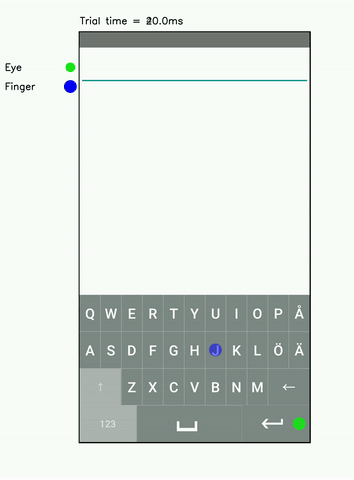

# Touchscreen Typing as Optimal Adaptation

This project presents a computational model of how people type on touchscreen keyboards.

For more information: 

  * [Project website](https://userinterfaces.aalto.fi/touchscreen-typing/)
  * [Research paper](https://userinterfaces.aalto.fi/touchscreen-typing/resources/touchscreen_typing_as_optimal_adaptation.pdf)

## Demo of the model


## Citation

Please cite our paper as:

```
@article{jokinen2021touchscreen,
  title={Touchscreen typing as optimal supervisory control},
  author={Jokinen, Jussi and Acharya, Aditya and Uzair, Mohammad and Jiang, Xinhui and Oulasvirta, Antti},
  booktitle={Proceedings of the 2021 CHI Conference on Human Factors in Computing Systems},
  pages={1--14},
  year={2021},
  publisher = {ACM},
  doi = {https://doi.org/10.1145/3411764.3445483}
}
```

## Getting Started

These instructions will get you a copy of the project up and running on your local machine for development and testing purposes.

### Prerequisites

Project uses Anaconda for open source python distribution. Goto https://www.anaconda.com/ for installation.

The project also uses GPU for training neural network based AI agents. For GPU support follow the link below

`https://docs-cupy.chainer.org/en/stable/install.html#install-cupy`

### Installing

```
git clone https://github.com/aditya02acharya/TypingAgent.git
```

Project provides an anaconda environment setup file to install project prerequisites.
Run the command below in the project directory.

```
conda env create -f configs/env_setup.yml
```

This command creates the anaconda environment **typing**. Use to command below to activate the environment.

```
conda activate typing
```

### Running the scripts

To train the agents, use the command below. Please check and edit the configuration files before running the scripts.

```
python main.py --train --all --config config.yml
```

To evaluate the trained agent, use the command below.

```
python main.py --all --config config.yml --type "hello world>"
```

To see all available argument, use the command below.

```
python main.py --help
```

### Configuration setting

All project configuration files are kept under configs folder.

- **config.yml**: this is the main configuration file. You can link config files for experiments here.
- **device_config.yml**: this file contains the device configuration. For example, layout configuration, key size, etc.
- **logging.yml**: centralised project logging configuration. Set logging mode to either `INFO`, `DEBUG`, `WARN`, `CRITICAL`. Logs are stored under logs directory.
- **training_config.yml**: model training configuration for each agent.
- **evaluation_config.yml**: model testing configuration for each agent.

### Project Storage

- **configs**: contains all configuration files.
- **data**: contains model outputs. Trained agent data kept under `models`. Test/Evaluation data kept under `output`.
- **layouts**: contains keyboard layouts. Layouts are stored as 2d-numpy array.
- **logs**: contains log files.
- **src**: contains project code base.

## Playing around the model via user interface

These instructions will help to evaluate and train the model on the browser of your local machine (preferably Chrome).
To start the UI, you will need to open **2 terminals** using commands below for starting frontend and backend respectively.

### Starting backend

Run the command below in the project directory.

```
conda env create -f configs/env_setup.yml
```

This command creates the anaconda environment **typing**. Use to command below to activate the environment.

```
conda activate typing
```

This command starts the backend on localhost:5000

```
flask run
```

### Starting frontend

Go to the **UI** directory.

```
cd UI
```

Run the command below in the **UI** directory for installing required libraries.

```
npm install @craco/craco --save
```

```
npm install --save react-scripts@2.1.8
```

This command starts the frontend on localhost:3000

```
npm start
```

Please wait for around 20s, and the landing page http://localhost:3000/#/ will be automatically opened on your browser.

## Authors

- **Jussi P.P. Jokinen**
- **Aditya Acharya**
- **Mohammad Uzair**
- **Xinhui Jiang**
- **Antti Oulasvirta**

## Contributors

- **Jussi P.P. Jokinen**
- **Aditya Acharya**
- **Mohammad Uzair**
- **Anqi Yang**

## Acknowledgments
This research has been supported by the Academy of Finland projects BAD and Human Automata, and Finnish Center for AI (FCAI).
